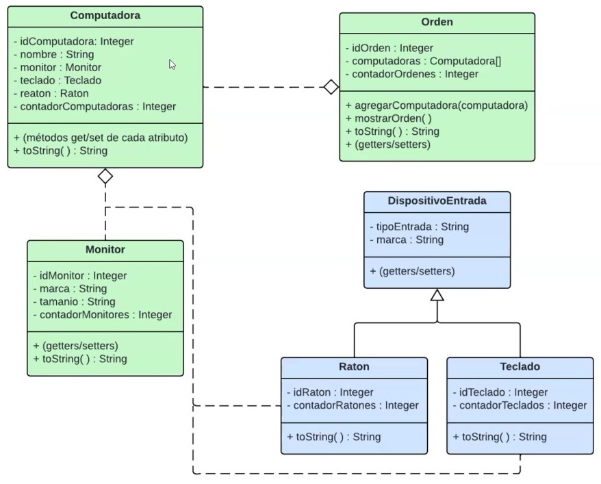

**_<h1 align="center">:vulcan_salute: Ejercicio En Clase :computer:</h1>_**
**_<h2 align="center">Módulo 2 - Fundamentos de Programación en Java</h2>_**

- Orden Computadoras incluye los elementos computador, monitor, raton y teclado creados según diagrama:

 
- Incluye archivo JavaDoc
